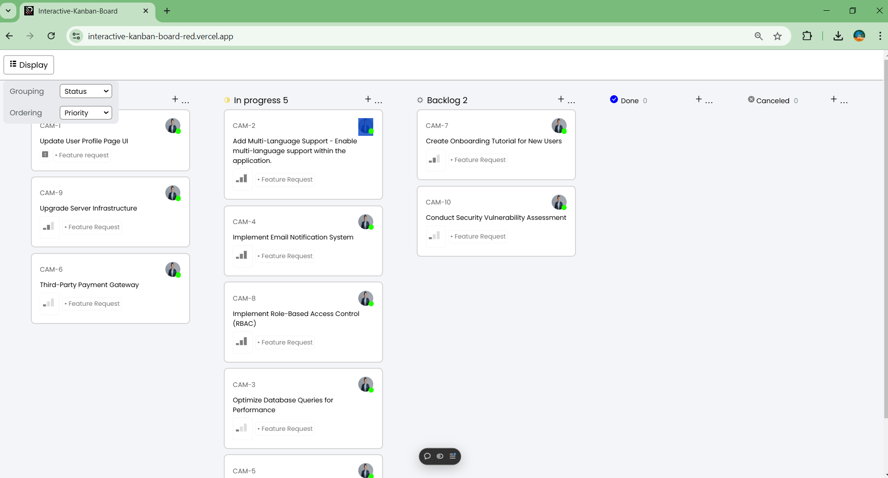
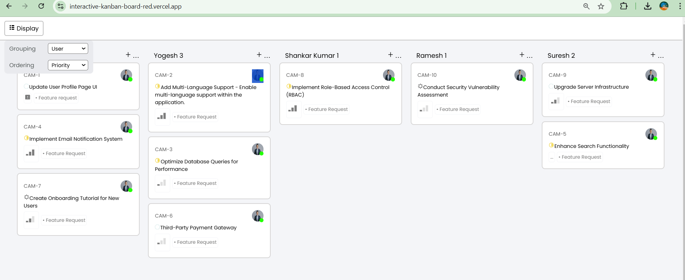
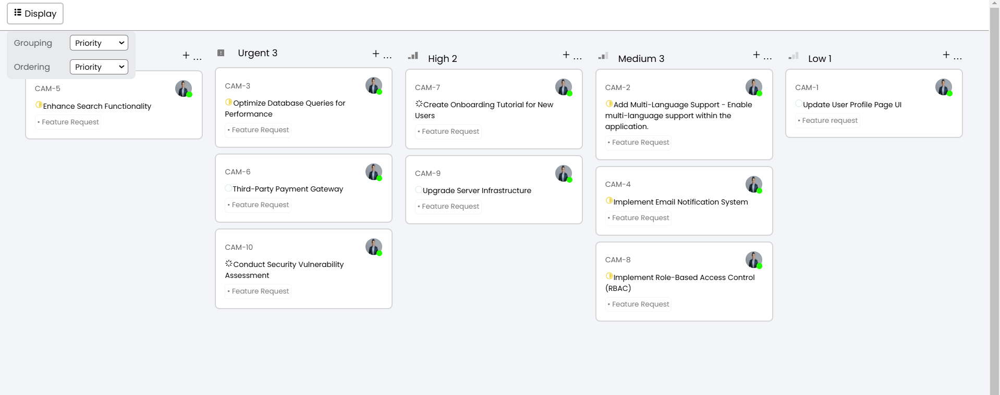

# **Interactive Kanban Board**

A fully responsive and feature-rich Kanban board built with **React.js**, designed to provide an intuitive way to organize and manage tasks dynamically. This application adapts seamlessly to user preferences, offering robust functionality for grouping, sorting, and visually tracking tasks.

---

## **✨ Key Features**

### **Dynamic Grouping**

Effortlessly group tasks with just a click:

- **By Status**: Tasks are categorized into stages like Backlog, Todo, In Progress, Done, and Canceled.
- **By User**: Tasks are displayed according to their assigned user, with live availability indicators.
- **By Priority**: Organize tasks from No Priority to Urgent.

### **Custom Sorting**

Refine task views for better prioritization:

- **Sort by Priority**: Tasks are ranked in descending priority order.
- **Sort by Title**: Tasks are arranged alphabetically for quick lookup.

### **User Preferences Persistence**

Your selected view is saved automatically, ensuring a consistent experience every time you return to the application.

### **Fully Responsive Design**

From desktop to mobile, the application maintains its functionality and aesthetics with horizontal scrolling and adaptive layouts.

### **Interactive Visuals**

- **Priority Badges**: Quickly identify task importance with distinct labels.
- **User Availability Indicators**: Green dots signify available users, while red dots indicate unavailability.

## Screenshots

### 1. Grouping by Status and Sorting by Priority (Default View)

This screenshot shows the default state of the Kanban board when the page is loaded or reloaded. By default, the tickets are grouped by **Status**, and they are sorted by **Priority** in descending order. The status groups include options like **Backlog**, **ToDo**, **In Progress**, **Done**, and **Canceled**.



### 2. Grouping by User and Sorting by Priority

In this view, the tickets are grouped by the **Assigned User**, which means each user will have their own column displaying the tasks assigned to them. The tickets within each user column are then sorted by **Priority** in descending order.



### 3. Grouping by Priority and Sorting by Priority

This screenshot shows the Kanban board when the grouping option is set to **Priority**. The tickets are grouped based on their priority levels (Urgent, High, Medium, Low, No Priority). Within each group, the tickets are also sorted by **Priority**, so the highest priority tasks (Urgent) will appear first.



## **🔍 How to Use**

1. **Access the Display Options:**

   - Click the "Display" button at the top.
   - Choose a grouping method: Status, User, or Priority.

2. **Sort Your View:**

   - Refine tasks by selecting either Priority or Title sorting.

3. **Explore the Kanban Board:**

   - Tasks will dynamically adjust to match your preferences.
   - View task details such as title, assigned user, status, and priority.

4. **Track User Availability:**
   - Green indicators: User is active.
   - Red indicators: User is unavailable.

---

## **💡 Technical Highlights**

### **API Integration**

The application fetches data from the [QuickSell API](https://api.quicksell.co/v1/internal/frontend-assignment), ensuring real-time updates for task management.

### **State Management**

- Utilizes `useState` for handling dynamic states and `useEffect` for fetching and rendering data.
- Saves user preferences locally with `localStorage` to maintain state across sessions.

### **Priority Mapping**

- **Urgent (4)**
- **High (3)**
- **Medium (2)**
- **Low (1)**
- **No Priority (0)**

### **Grouping Criteria**

1. **By Status**: Organize tasks into workflow stages.
2. **By User**: Arrange tasks under assigned users with live indicators.
3. **By Priority**: Quickly identify high-impact tasks.

---

## **🎨 Custom Styling**

- Developed using **pure CSS** for a professional and lightweight design.
- Fully responsive layout with visually distinct task cards, clean typography, and smooth transitions.
- Matches the provided UI guidelines perfectly.

---

## **👤 About the Developer**

**Raghav Agiwal**

- 📞 Phone: +91 9529597215
- 📧 Email: [raghavagiwal20@gmail.com](mailto:raghavagiwal20@gmail.com)

---

## **🤝 Contributions Welcome**

1. Fork the repository to start.
2. Create a new branch:
   ```bash
   git checkout -b feature/NewFeature
   ```
3. Commit your changes:
   ```bash
   git commit -m 'Add NewFeature'
   ```
4. Push the branch:
   ```bash
   git push origin feature/NewFeature
   ```
5. Submit a pull request for review.

---

## **📜 License**

This project is licensed under the **MIT License**. Feel free to modify and use it in your own projects.

---

## **🙏 Acknowledgments**

- **QuickSell** for providing the API and project inspiration.
- The vibrant **React.js community** for excellent tools and documentation.

---
